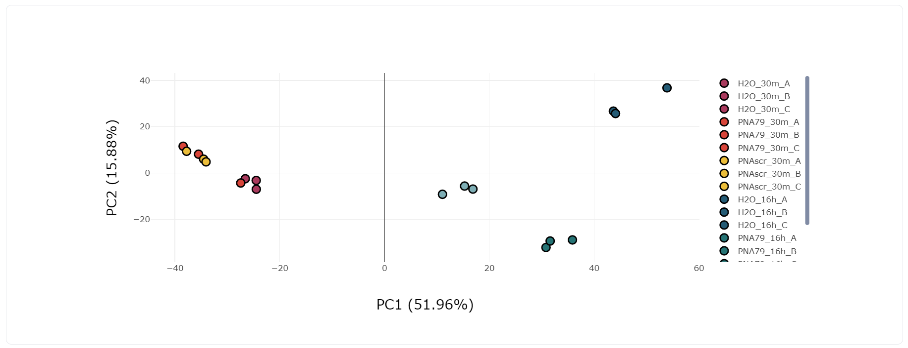
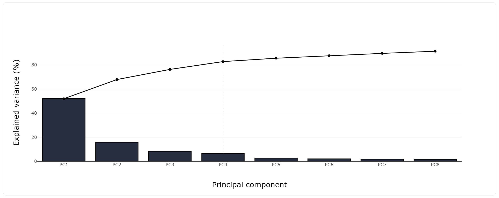
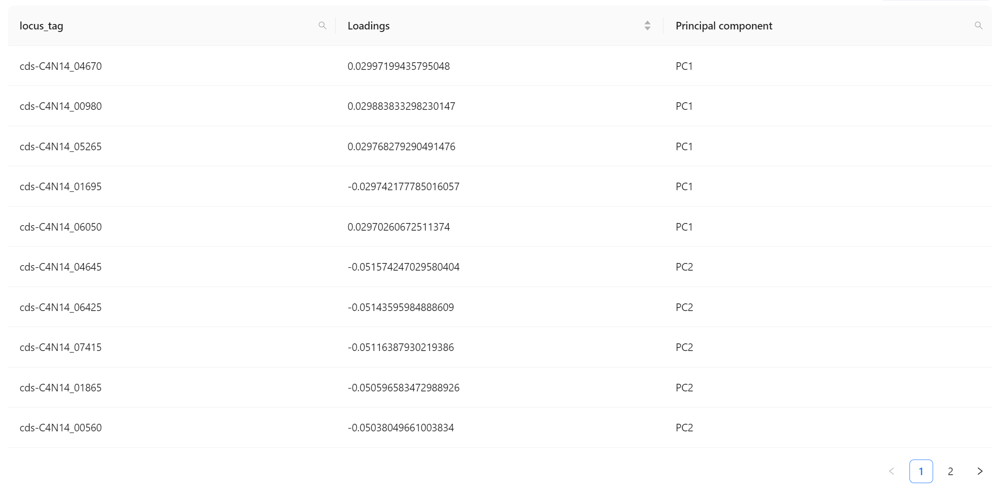
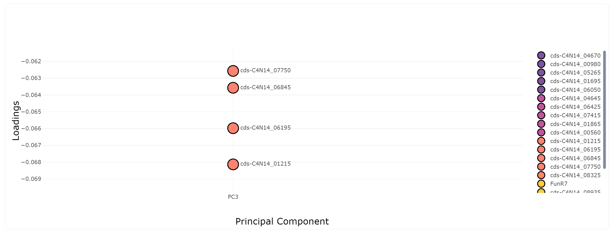

# PCA Generator

- [Home](README.md)
- **[Features](features.md)**
- [Infrastructure](infrastructure.md)
- [Install for dev](install_for_dev.md)
- [Install for production](install_for_production.md)
- [Integrate with Micromix](integrate_with_micromix.md)
- [How to modify this app to create another Micromix enabled app](how_to_modify_this_app_to_create_another_micromix_enabled_app.md)

## Features

<mark>PCA Plot Generation in 2D and 3D</mark> 

Visualize the 2D or 3D of PCA plot.

  

&nbsp;

<mark>Scree Plot Generation</mark>

Determine the number of principal components to retain in your analysis. This plot displays the proportion of total variance in the data for each principal component.

&nbsp;

<mark>Loadings Table Generation</mark>

To see which variables contribute how much to each principal component with loadings table.

&nbsp;

<mark>Top 5 Contributors</mark>

Identify the top 5 contributors to each principal component.

